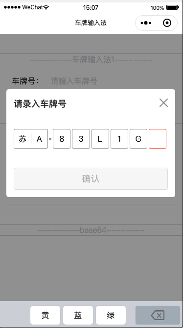

# vehicle-keyboard-wx
微信小程序车牌输入法

* 输入法一  
根据 [小程序--自定义键盘车牌号](https://juejin.im/post/5c4e7069e51d454b0d75d3db)修改实现的车牌输入法插件（carKeyboard），增加了车牌颜色输入支持，但不支持同时输入新能源车牌和颜色，通过 inputColor="true" 可将最后一位设置为车牌颜色位，不设置则默认为新能源位。```<carKeyboard carNum="{{carNum}}" inputColor="true" bind:onOk="onOk" bind:onCancel="onCancel" />```



* 输入法二  
从 https://github.com/parkingwang/vehicle-keyboard-js.git 移植的适合微信小程序的车牌输入法插件（keyboard），支持新能源车牌和特殊车牌。（fork自https://github.com/songtao542/vehicle-keyboard-wx）


